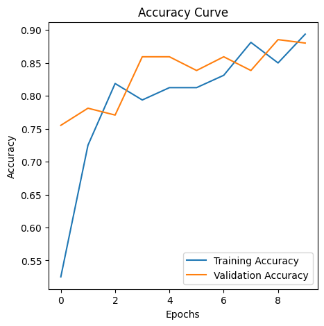

# Waste Classification using Transfer Learning (VGG16)

## Overview

This repository packages a transfer-learning workflow for waste image
classification using `VGG16`. The maintained public surface centers on the
bundled checkpoint, `predict.py`, and the supporting project files, while the
preserved notebook remains available for reproducibility and stored training
outputs.

The goal is to classify waste images into two categories:

- `O`: Organic
- `R`: Recyclable

The archived notebook in [notebooks/main.ipynb](notebooks/main.ipynb) captures
the original training, fine-tuning, evaluation, and visual outputs that the
repository documents.

## Key Results

- Fine-tuned test accuracy: `0.83`
- Best validation accuracy: `0.8854`
- Best validation loss: `0.2709`
- Input size: `150x150`
- Classes: `Organic (O)` and `Recyclable (R)`



## Model Availability

One trained checkpoint is currently included in this repository:

- `models/vgg16_waste_classifier.keras`

The repository does not bundle the dataset, but the included checkpoint can be used directly with [predict.py](predict.py). The notebook can still be rerun locally to regenerate checkpoints if needed.

## Business / Industrial Context

GreenCity is struggling with manual waste sorting, especially when recyclable and organic waste are mixed together. EcoClean needs an AI-based image classifier that can support smarter waste management, reduce contamination in recycling streams, and improve sorting efficiency.

## Approach

- Transfer learning with a pre-trained `VGG16` backbone (`include_top=False`, ImageNet weights)
- A custom binary classification head with dense and dropout layers
- Image preprocessing with `150x150` RGB inputs and `1/255` rescaling
- Data augmentation on the training split with horizontal flip and small width / height shifts
- Fine-tuning by unfreezing the last VGG16 convolution block starting from `block5_conv3`

## Stored Run Metadata

- TensorFlow version: `2.17.0`
- Generator counts:
  - Training: `800` images
  - Validation: `200` images
  - Test: `200` images
- Input size: `150 x 150`
- Validation split: `0.2`
- Epochs configured in the notebook: `10`
- Training configuration kept from the source notebook: `steps_per_epoch=5`
- Frozen-backbone model summary:
  - Total params: `19,172,673`
  - Trainable params: `4,457,985`
  - Non-trainable params: `14,714,688`

## Results

The following numbers come from the stored notebook outputs only. They are not presented as a fresh rerun.

| Model | Test Accuracy | Organic (`O`) Precision / Recall | Recyclable (`R`) Precision / Recall | Best Validation Accuracy | Best Validation Loss |
| --- | --- | --- | --- | --- | --- |
| Extract-features VGG16 | `0.79` | `0.76 / 0.84` | `0.82 / 0.74` | `0.8802` | `0.3567` |
| Fine-tuned VGG16 | `0.83` | `0.80 / 0.88` | `0.87 / 0.78` | `0.8854` | `0.2709` |

Evaluation in the notebook is performed on `100` held-out test images loaded explicitly in the code (`50` organic and `50` recyclable).

## Why Fine-Tuning Helped

The extract-features model reached `0.79` test accuracy, while the fine-tuned model improved that result to `0.83`. In this workflow, unfreezing the final VGG16 convolution block allowed the model to adapt better to waste-image features than relying only on general ImageNet features.

## Visual Outputs

- Training curves:
  [Extract-features loss](outputs/extract_features_loss_curve.png),
  [Extract-features accuracy](outputs/extract_features_accuracy_curve.png),
  [Fine-tuned loss](outputs/fine_tuned_loss_curve.png),
  [Fine-tuned accuracy](outputs/fine_tuned_accuracy_curve.png)
- Evaluation artifacts:
  [Combined evaluation reports](outputs/evaluation_reports.txt),
  [Extract-features report](outputs/extract_features_classification_report.txt),
  [Fine-tuned report](outputs/fine_tuned_classification_report.txt)
- Qualitative examples:
  [Augmented training samples](outputs/augmented_organic_samples.png),
  [Extract-features prediction 0](outputs/extract_features_prediction_example_0.png),
  [Extract-features prediction 1](outputs/extract_features_prediction_example_1.png),
  [Fine-tuned prediction 1](outputs/fine_tuned_prediction_example_1.png)

## Project Structure

```text
waste-classification-transfer-learning/
+-- data/
|   +-- README.md
+-- .github/
|   +-- workflows/
|       +-- ci.yml
+-- .gitattributes
+-- CITATION.cff
+-- LICENSE
+-- models/
|   +-- vgg16_waste_classifier.keras
+-- notebooks/
|   +-- README.md
|   +-- main.ipynb
+-- outputs/
|   +-- *.png
|   +-- *.txt
+-- .gitignore
+-- pyproject.toml
+-- predict.py
+-- README.md
+-- requirements-dev.txt
+-- requirements-notebook.txt
+-- requirements.txt
+-- tests/
|   +-- test_predict.py
```

## Dataset

Place the dataset locally under `data/o-vs-r-split/` before running the notebook:

```text
data/
+-- o-vs-r-split/
    +-- train/
    |   +-- O/
    |   +-- R/
    +-- test/
        +-- O/
        +-- R/
```

The preserved notebook also contains an optional helper cell that can download
the same reduced dataset if the folder is missing.

## How to Run

For the reproducible notebook / training workflow:

1. `python -m venv .venv`
2. `.venv\Scripts\activate`
3. `pip install -r requirements.txt`
4. For the notebook / training workflow, install the extra dependencies with `pip install -r requirements-notebook.txt`
5. Put the dataset inside `data/o-vs-r-split/`
6. Open and run [notebooks/main.ipynb](notebooks/main.ipynb)

## Quick Inference

The repository already includes a trained checkpoint at `models/vgg16_waste_classifier.keras`, so you can run inference directly after installing the runtime dependencies:

```bash
python predict.py path\\to\\image.jpg
```

Optional:

```bash
python predict.py path\\to\\image.jpg --model models\\vgg16_waste_classifier.keras
```

By default, the script loads `models/vgg16_waste_classifier.keras`.

Example output format:

```bash
Model: models/vgg16_waste_classifier.keras
Predicted class: Organic (O)
Recyclable probability: 0.1821
Organic probability: 0.8179
```

## Limitations

- The dataset is not included in the repository.
- Raw sample input images are not bundled in the repository because no confirmed dataset images are tracked here.
- The current project targets binary classification only: `Organic (O)` vs `Recyclable (R)`.
- Reported metrics are taken from stored notebook outputs already present in the project, not from a fresh rerun in this session.
- The bundled model file is relatively large for a standard Git repository.

## Research Evidence Pack

The `docs/research_pack/` directory contains institution-neutral research and
model-release documentation for the waste classification workflow, including an
[academic research brief](docs/research_pack/ACADEMIC_RESEARCH_BRIEF.md),
[model card](docs/research_pack/MODEL_CARD.md),
[model release card](docs/research_pack/MODEL_RELEASE_CARD.md),
[checkpoint and inference card](docs/research_pack/CHECKPOINT_AND_INFERENCE_CARD.md),
[metric provenance matrix](docs/research_pack/METRIC_PROVENANCE_MATRIX.md),
[dataset and task card](docs/research_pack/DATASET_AND_TASK_CARD.md),
[sustainability use-case boundary](docs/research_pack/SUSTAINABILITY_USE_CASE_BOUNDARY.md),
[failure mode matrix](docs/research_pack/FAILURE_MODE_MATRIX.md),
[calibration and thresholding protocol](docs/research_pack/CALIBRATION_AND_THRESHOLDING_PROTOCOL.md),
[interpretability protocol](docs/research_pack/INTERPRETABILITY_PROTOCOL.md),
[inference reproducibility guide](docs/research_pack/INFERENCE_REPRODUCIBILITY_GUIDE.md),
and a [reproducibility checklist](docs/research_pack/REPRODUCIBILITY_CHECKLIST.md).

Run:

```bash
python tools/evidence/validate_research_pack.py
```

## Repository Notes

- The trained checkpoint `models/vgg16_waste_classifier.keras` is included in the repository.
- Other local model files remain excluded from Git by default.
- Runtime dependencies live in `requirements.txt`, notebook extras in `requirements-notebook.txt`, and test / lint tooling in `requirements-dev.txt`.
- `predict.py` is the direct usage path for the bundled checkpoint, while the preserved notebook remains available for reproducibility and provenance.
- A confusion matrix was not present in the source notebook outputs, so none is claimed here.

## License

Code in this repository is released under the [MIT License](LICENSE). Dataset
usage remains subject to the upstream data source and any terms that apply to
that dataset outside this repository.
